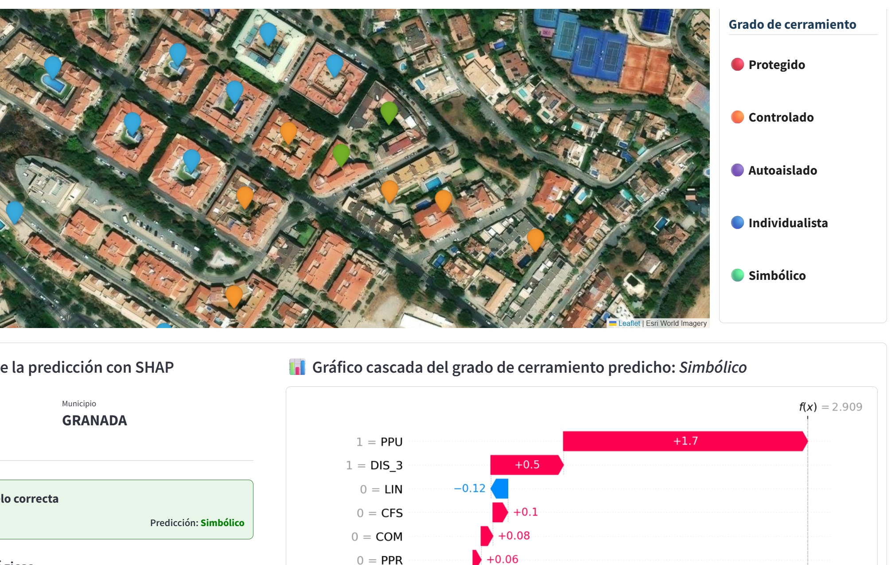

# Data Scientist | Machine Learning & AI | Software Engineering

Data Scientist and Software Engineer with more than 3 years of professional experience developing **data-driven software solutions** across the entire data lifecycle.

I hold a **Bsc** and **MSc in Telecommunications Engineering** and an **MSc in Data Science and Computer Engineering** from the University of Granada, with a strong academic record, including **9 highest-honors distinctions**.

## 🛠️ Tech Stack
- **Languages:** Python, SQL
- **Data:** Pandas, Numpy, PySpark, PostgreSQL, MySQL, MongoDB
- **Machine Learning:** Scikit-learn, XGBoost, PyTorch, SHAP, River, Gym
- **Tools & Deployment:** Git, Docker, Streamlit

## 📚 Featured Projects
<table>
<tr>
<td width="50%" valign="top">

### 🏙️ Explainable AI for the Study of Urban Fragmentation

End-to-end Data Science and XAI project for the automatic classification of residential typologies, combining Machine Learning with model interpretability techniques.

`Python` `Scikit-learn` `XGBoost` `SHAP` `Streamlit`

🔗 **[Repository](https://github.com/davidfernxndez/urban-typology-xai)**
🌐 **[Web App](https://urban-tipology-xai.streamlit.app/)**

</td>

<td width="50%" valign="top">

### ⚡ Active Learning with Apache Spark

A scalable Active Learning framework combining uncertainty and diversity-based instance selection with Apache Spark and MLlib.

`Python` `PySpark` `MLlib` `K-Means` 

🔗 **[Repository](https://github.com/davidfernxndez/spark-active-learning)**

</td>
</tr>

<tr>
<td width="50%" valign="top">

### 📡 Deep Reinforcement Learning agent to reduce energy consumption in 5G

DQN-based system designed to reduce energy consumption in 5G networks while maintaining service quality.

`Python` `PyTorch` `Gymnasium` `DQN`

🔗 **[Repository](https://github.com/davidfernxndez/DQN-Resource-Allocation-Agent-in-5G)**

</td>

<td width="50%" valign="top">

### 🎙️ Pitch Correction System

Open-source audio processing engine and desktop application developed from scratch for real-time vocal pitch correction.

`Matlab` `UI Design` `DSP` `Audio Processing` `Product software`

🔗 **[Repository](https://github.com/davidfernxndez/pitch-correction-system)**

</td>
</tr>
</table>

## 📫 Connect with me
[LinkedIn](https://www.linkedin.com/in/david-fernxndez-martinez/) · [Mail](david.fernxndez.martinez@gmail.com)
