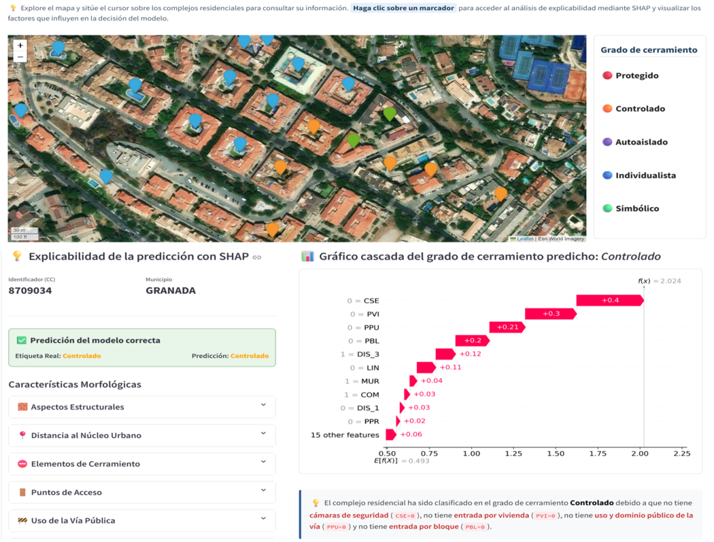
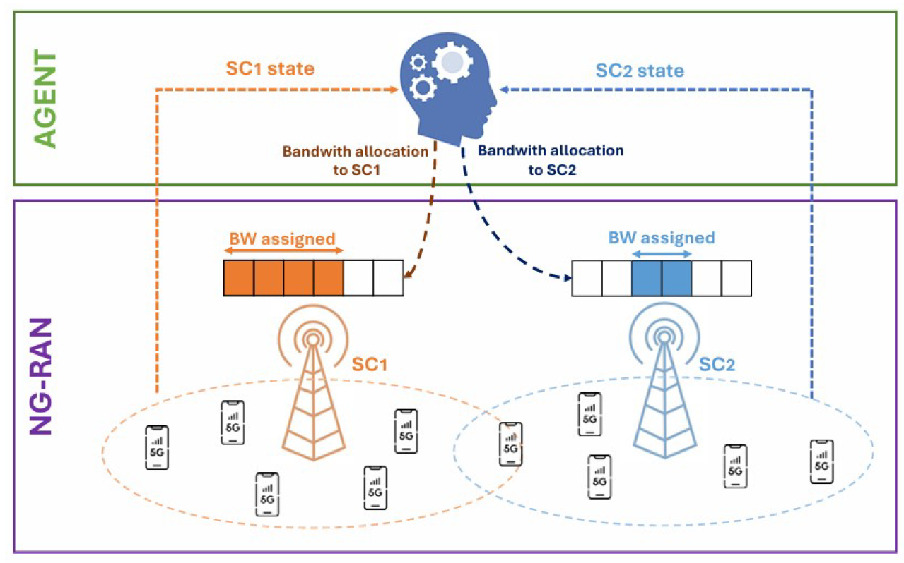
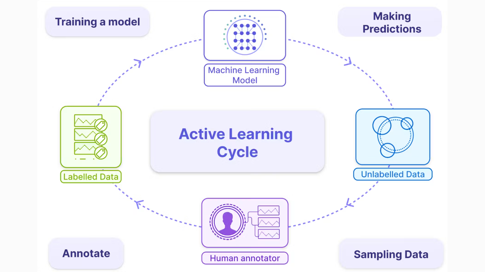
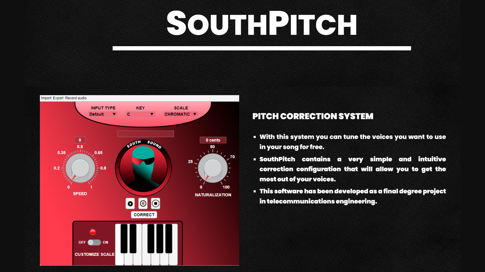

# Data Scientist | Machine Learning & AI | Software Engineering

Data Scientist and Software Engineer with more than 3 years of professional experience developing **data-driven software solutions** across the entire data lifecycle.

I hold a **Bsc** and **MSc in Telecommunications Engineering** and an **MSc in Data Science and Computer Engineering** from the University of Granada, with a strong academic record, including **9 highest-honors distinctions**.

## 🛠️ Tech Stack

### **Programming Languages**

### **Big Data Analytics and Databases**

### **Machine Learning, AI and Data Science**

### **MLOps & Deployment**

## 📚 Featured Projects

Here are some highlights from my portfolio. Feel free to explore the repositories for detailed documentation, code and Live Demos:

<table>
<tr>
<td width="50%" valign="top">

### 🏙️ Explainable AI for Urban Fragmentation

End-to-end Data Science and XAI project for the automatic classification of residential typologies, combining Machine Learning with model interpretability techniques.

`Python` `Scikit-learn` `XGBoost` `SHAP` `Streamlit`

🔗 **[Repository](https://github.com/davidfernxndez/urban-typology-xai)**  
🌐 **[Web App](https://urban-tipology-xai.streamlit.app/)**

</td>

<td width="50%" valign="top">

### 📡 Deep Reinforcement Learning for Energy Saving in 5G Networks

DQN-based system designed to reduce energy consumption in 5G networks while maintaining service quality.

`Python` `Deep Reinforcement Learning` `Gymnasium` `DQN`

🔗 **[Repository](https://github.com/davidfernxndez/DQN-Resource-Allocation-Agent-in-5G)**  
📄 **[Paper — IWANN 2025](https://link.springer.com/chapter/10.1007/978-3-032-02725-2_28)**

</td>
</tr>

<tr>
<td width="50%" valign="top">

### ⚡ Active Learning with Apache Spark

Scalable Active Learning framework combining uncertainty and diversity-based instance selection with Apache Spark and MLlib.

`Python` `PySpark` `MLlib` `K-Means`

🔗 **[Repository](https://github.com/davidfernxndez/spark-active-learning)**  
&nbsp;

</td>

<td width="50%" valign="top">

### 🎙️ Pitch Correction System

Open-source audio processing engine and desktop application developed from scratch for real-time vocal pitch correction.

`MATLAB` `UI Design` `DSP` `Audio Processing`

🔗 **[Repository](https://github.com/davidfernxndez/pitch-correction-system)**  
🌐 **[Web App](https://sites.google.com/view/southsound/southpitch)**

</td>
</tr>
</table>

## 📫 Connect with me
I am interested in opportunities in **Data Science**, **Machine Learning**, and **AI**, where I can combine my background in engineering, data, and software development. Feel free to contact me via Linkedin or Email 😊

🔗 **LinkedIn:** [https://www.linkedin.com/in/david-fernxndez-martinez/](https://www.linkedin.com/in/david-fernxndez-martinez/)  
✉️ **Email:** [david.fernxndez.martinez@gmail.com](mailto:david.fernxndez.martinez@gmail.com)
